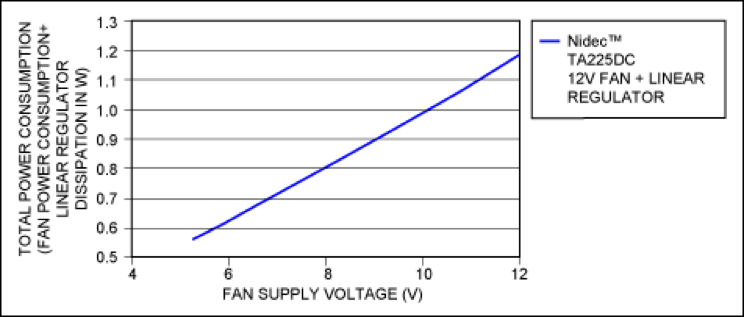

#Fan speed controller
##2019.03.16

[Source 1: https://www.overclockers.com]( https://www.overclockers.com/pwm-fan-controller/)

2) [https://www.onsemi.com/PowerSolutions/product.do?id=ADT7467](https://www.onsemi.com/PowerSolutions/product.do?id=ADT7467)

3) part listed in folder: [https://datasheets.maximintegrated.com/en/ds/MAX31740.pdf](https://datasheets.maximintegrated.com/en/ds/MAX31740.pdf)

4) other part: [https://www.mouser.com/datasheet/2/268/21756b-74015.pdf](https://www.mouser.com/datasheet/2/268/21756b-74015.pdf
)

6) [https://www.analog.com/en/analog-dialogue/articles/how-to-control-fan-speed.html](https://www.analog.com/en/analog-dialogue/articles/how-to-control-fan-speed.html
)

7)) [https://www.maximintegrated.com/en/products/sensors/MAX31740.html](https://www.maximintegrated.com/en/products/sensors/MAX31740.html ) ultra simple

8) [Maxim Tutorial - Fan Speed](https://www.maximintegrated.com/en/app-notes/index.mvp/id/1784):

**PWM Control**

During PWM control, the voltage applied to the fan is either its rated voltage (12V in the case of a 12V fan) or 0V. However, because the fan is spinning at something less than its rated speed (remember, that is the whole idea), its back EMF is reduced. This causes higher-than-nominal current flow through the windings during the on period of the PWM cycle. Although fans are designed to handle increased currents, such as during startup, heightened currents at 30 times per second for the life of the fan can entail negative reliability issues. But even with these negatives, PWM control can be the appropriate solution in low-cost noncritical applications.

**Linear Regulation**

Worst-case power dissipation in the pass element can be estimated by the following equation: $$P = 1/4(V_{MAX} × I_{MAX})$$,
where IMAX and VMAX are the rated voltages and currents of the fan, respectively.

*Also, even though a power-dissipating device is being used, there is still an overall power savings when fan speed is reduced.*

Fans require a certain voltage before they will start. This is called "startup voltage." Once a fan is already spinning, decreasing the voltage below the stall voltage will cause the fan to stop. The startup voltage is equal to or (usually) greater than the stall voltage. Typically they are 25% to 50% of the rated voltage for the fan. When linear regulation is used without speed monitoring, there is no way of knowing if a fan has stalled or even started.

**DC-DC Regulation**

Because of the increased cost and complexity of DC-DC converters and the limited power savings, DC-DC regulators are **usually reserved for** battery-powered systems or systems that use high-power fans or **a large number of fans**. As always, with all DC-DC converters, care must be taken during layout.

ex. 12v dc/dc [https://www.rohm.com/news-detail?news-title=the-industrys-first-dc-dc-converter-capable-of-dc-fan-motor-speed-control&defaultGroupId=false](https://www.rohm.com/news-detail?news-title=the-industrys-first-dc-dc-converter-capable-of-dc-fan-motor-speed-control&defaultGroupId=false)

##**Comparisons:**
For Nidec [D08A](https://www.nidec.com/en-Global/product/fan/category/F010/G070/P2000261/):  
**Input voltage:** 12VDC  
**Rated current:** 0.09A  
**Rated Power:** 1.08W  

**Linear**:   
Use a resistor.  
$$R= V/I = (12-7)/(0.06 A_{est.@5V})= 83.3 \Omega  $$  
 
$$P_{res} = I^2 * R = 0.3W$$  
$$P_{fan@7V} = IV = 0.42WW$$   
$$P_T = 0.72W$$   

**PWM**:   

$$
P_{@50\%duty} = V(I*0.5) = 0.54W 
$$ 

Pros: 0.18W more efficient  
Cons: more complex to integrate   
